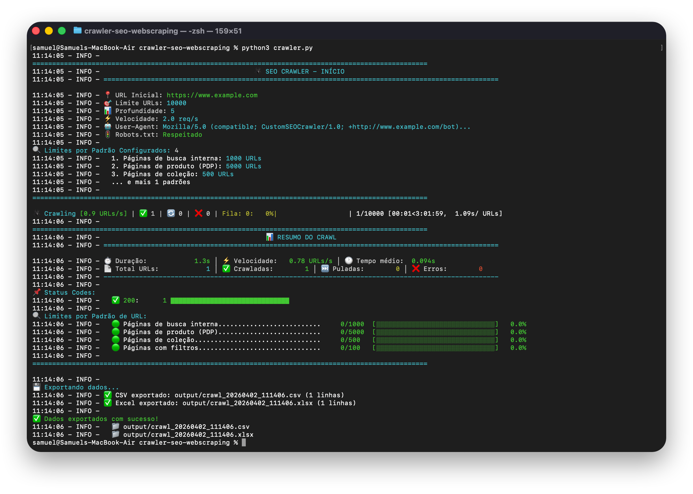
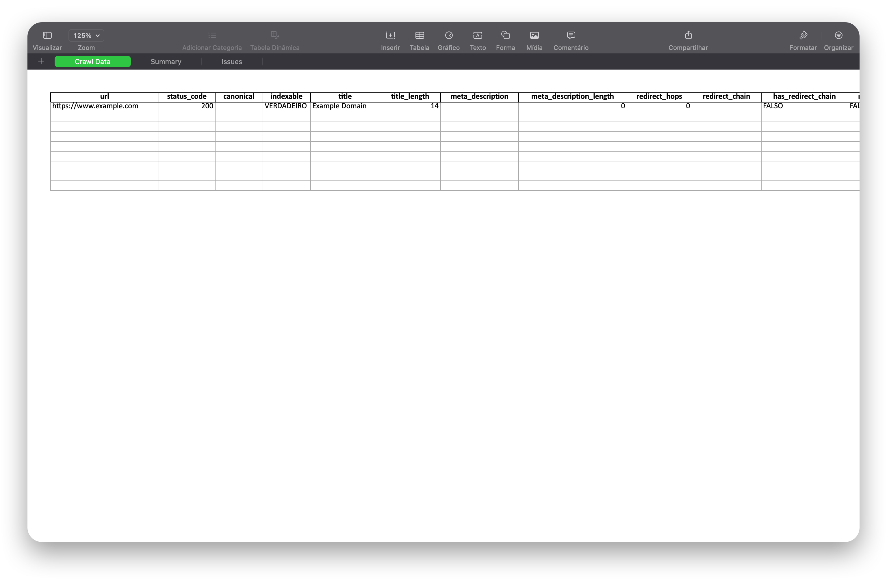

# 🕷️ SEO Crawler - Custom Web Crawler

Crawler SEO customizado desenvolvido para auditorias técnicas de SEO.




## 🎯 Características Principais

- ✅ **Limites por Padrão de URL**: Rastreio por amostras de cada tipo de página (ex: 1000 buscas, 5000 produtos)
- ✅ **Rate Limiting Configurável**: Controle total sobre velocidade de crawl
- ✅ **Respeito a robots.txt**: Comportamento ético e controlado
- ✅ **Extração Completa de Dados SEO**: Titles, metas, headings, canonical, structured data, etc.
- ✅ **Export em múltiplos formatos**: CSV e Excel com abas separadas
- ✅ **Relatórios de Issues**: Detecta automaticamente problemas de SEO
- ✅ **Sem Banco de Dados**: Tudo em memória e arquivos
- ✅ **Progress Bar em Tempo Real**: Acompanhe o progresso do crawl
- ✅ **Logging Detalhado**: Controle total sobre o que está acontecendo

## 📋 Pré-requisitos

- Python 3.9 ou superior
- pip (gerenciador de pacotes Python)
- 4GB+ RAM (recomendado para crawls grandes)

## 🚀 Instalação

### 1. Instalar Python

- Baixe em: https://www.python.org/downloads/
- Durante instalação, marque "Add Python to PATH"

### 2. Instalar dependências

```bash
pip install -r requirements.txt
```

## ⚙️ Configuração

Edite o arquivo `config.yaml` com suas configurações:

### Configurações Principais

```yaml
# URL inicial
start_url: "https://www.seusite.com.br"

# Limites gerais
crawl:
  max_depth: 5              # Profundidade máxima
  max_total_urls: 10000     # Total de URLs a rastrear
  follow_internal_only: true
```

### Limites por Padrão de URL (IMPORTANTE!)

Esta é a feature chave para sites grandes:

```yaml
url_pattern_limits:
  # Páginas de busca - apenas 1000 exemplos
  - pattern: "/busca/"
    limit: 1000
    description: "Páginas de busca interna"
  
  # Produtos - 5000 exemplos
  - pattern: "/p/"
    limit: 5000
    description: "Páginas de produto (PDP)"
  
  # Coleções - 500 exemplos
  - pattern: "/colecao/"
    limit: 500
    description: "Páginas de coleção"
  
  # URLs com filtros - apenas 100
  - pattern: "\\?.*filtro="
    limit: 100
    description: "Páginas com filtros"
    regex: true  # Usa expressão regular
```

### Exclusões

```yaml
exclude_patterns:
  - pattern: "/admin"
    description: "Área administrativa"
  
  - pattern: "/carrinho"
    description: "Páginas de carrinho"
  
  - pattern: "/checkout"
    description: "Páginas de checkout"
```

### Rate Limiting

```yaml
rate_limiting:
  requests_per_second: 2.0          # 2 requests/segundo
  random_delay_range: [0.5, 1.5]    # Delay aleatório extra
  request_timeout: 30                # Timeout por request
  max_retries: 3                     # Tentativas em caso de erro
```

### User Agent

```yaml
# Use um user-agent que não seja bloqueado
user_agent: "Mozilla/5.0 (compatible; CustomSEOCrawler/1.0; +http://www.seusite.com.br/bot)"

# Ou simule Googlebot (se permitido)
# user_agent: "Mozilla/5.0 (compatible; Googlebot/2.1; +http://www.google.com/bot.html)"
```

## 🏃 Como Usar

### 1. Configurar

Edite `config.yaml` com a URL do seu site e os padrões de URL que deseja limitar.

### 2. Executar

```bash
python crawler.py
```

### 3. Acompanhar

O crawler mostrará:
- Progress bar em tempo real
- URLs sendo crawladas
- Estatísticas atualizadas
- Erros encontrados

### 4. Resultados

Os arquivos serão salvos na pasta `output/`:

```
output/
├── crawl_20240401_143022.csv      # Todos os dados em CSV
└── crawl_20240401_143022.xlsx     # Excel com múltiplas abas
    ├── Crawl Data      # Dados completos
    ├── Summary         # Resumo e estatísticas
    └── Issues          # Problemas detectados
```

### Como mudar a ordenação dos dados do resultado?

Acesse o arquivo `config.yaml`e você vai ver uma seção chamada `fields`. Esse bloco de código é responsável pela ordem dos dados:

```bash
# Campos a incluir no export (ordem será mantida)
  fields:
    - url
    - canonical
    - status_code
    - indexable
    - crawl_depth
    - title
    - title_length
    - meta_description
    - meta_description_length
    - h1
    - h1_count
    - meta_robots
    - word_count
    - internal_links_count
    - external_links_count
    - images_count
    - images_without_alt
    - content_type
    - response_time
    - found_on_url
    - found_on_anchor_text
```

### Habilitar ou desabilitar coleta de informações

No arquivo `config.yaml`, é possível habilitar ou desabilitar dados a serem extraídos. Basta mudar entre `true` ou `false`:

```bash
# Configurações de extração de dados
extraction:
  # Elementos HTML a extrair
  extract_title: true
  extract_meta_description: true
  extract_meta_keywords: true
  extract_h1: true
  extract_h2: true
  extract_canonical: true
  extract_meta_robots: true
  extract_og_tags: false
  extract_twitter_cards: false
  extract_structured_data: true
  extract_hreflang: false
```

### Como mudar a classificação de páginas?

Para mudar a classificação de páginas, é necessário editar os padrões de URL no `extractors.py`:

```bash
def _detect_content_type(self, url: str, soup: BeautifulSoup) -> str:
        if '/produto/' in url or '/p/' in url:
            return 'product'
        #URL que contém /categoria/ ou /c/    
        elif '/categoria/' in url or '/c/' in url:
            # nome "category"
            return 'category'
        elif '/busca/' in url or '/search' in url:
            return 'search'
        elif '/blog/' in url:
            return 'blog'
```

## 📊 Dados Coletados

### Elementos SEO

- **Meta Tags**: title, description, keywords
- **Headings**: H1, H2 (contagem e conteúdo)
- **Canonical**: URL canônica
- **Meta Robots**: noindex, nofollow
- **Open Graph**: og:title, og:description, og:image, etc.
- **Structured Data**: JSON-LD, Microdata
- **Hreflang**: Tags de idioma alternativo
-**Redirects**: Análise de redirect chain (origem, quantidade de redirects, tipo e destino)

### Análise de Conteúdo

- **Contagem de palavras**
- **Imagens**: Total e sem ALT text
- **Links**: Internos, externos, nofollow
- **Indexabilidade**: Se a página pode ser indexada

### Performance

- **Status Code**: 200, 301, 404, etc.
- **Response Time**: Tempo de resposta
- **Crawl Depth**: Profundidade da URL

### Metadados

- **Found On URL**: De onde a URL foi encontrada
- **Anchor Text**: Texto âncora do link
- **Content Type**: homepage, product, category, blog, etc.

## 🔍 Issues Detectados Automaticamente

O crawler detecta automaticamente:

- ❌ **Títulos faltando**
- ⚠️ Títulos muito curtos (<30 chars)
- ⚠️ Títulos muito longos (>60 chars)
- ❌ **Meta descriptions faltando**
- ⚠️ Meta descriptions curtas (<120 chars)
- ⚠️ Meta descriptions longas (>160 chars)
- ❌ **H1 faltando**
- ⚠️ Múltiplos H1
- ⚠️ **Imagens sem ALT text**
- ℹ️ Páginas não-indexáveis (noindex, canonical diferente)

## 🎨 Exemplo de Uso

### Caso de Uso 1: E-commerce Grande

```yaml
start_url: "https://www.exemplo.com.br"

crawl:
  max_depth: 6
  max_total_urls: 50000

url_pattern_limits:
  - pattern: "/busca/"
    limit: 2000
  
  - pattern: "/produto/"
    limit: 10000
  
  - pattern: "/categoria/"
    limit: 1000

rate_limiting:
  requests_per_second: 1.5  # Mais conservador para não sobrecarregar
```

### Caso de Uso 2: Blog/Conteúdo

```yaml
start_url: "https://www.seublog.com.br"

crawl:
  max_depth: 4
  max_total_urls: 5000

url_pattern_limits:
  - pattern: "/blog/"
    limit: 3000
  
  - pattern: "/categoria/"
    limit: 100

rate_limiting:
  requests_per_second: 3.0  # Pode ser mais rápido
```

## 🐛 Troubleshooting

### Erro: ModuleNotFoundError

```bash
# Instale as dependências novamente
pip install -r requirements.txt
```

### Crawler muito lento

1. Aumente `requests_per_second` no config
2. Reduza `random_delay_range`
3. Reduza `request_timeout`

### Muitas URLs sendo bloqueadas

1. Verifique `robots.txt` do site
2. Mude `respect_robots_txt: false` (use com cuidado!)
3. Ajuste user-agent

### Crawler sendo bloqueado

1. **Reduza velocidade**: `requests_per_second: 0.5`
2. **Aumente delays**: `random_delay_range: [2, 4]`
3. **Mude user-agent** para algo mais "humano"
4. **Adicione headers customizados** (fale com time de cyber security)

### Memória insuficiente

1. Reduza `max_total_urls`
2. Use limites por padrão mais restritivos
3. Crawle por partes (subfolders)

## 🔐 Considerações de Segurança

1. **Sempre respeite robots.txt** (deixe `respect_robots_txt: true`)
2. **Use rate limiting adequado** para não sobrecarregar servidores
3. **Identifique-se claramente** no user-agent
4. **Coordene com time de cyber security** antes de crawls em produção
5. **Teste em staging primeiro** se possível

## 📝 Licença

Código desenvolvido usando os agentes de IA Claude e Codex. Uso liberado para todos que se beneficiarem do projeto.

## 👨‍💻 Autor

Samuel - Especialista em SEO @ Casas Bahia

LinkedIn:  https://www.linkedin.com/in/samuel-p-vieira/

Codex, Claude e Gemini

---

**Dúvidas?** Abra uma issue ou entre em contato!
